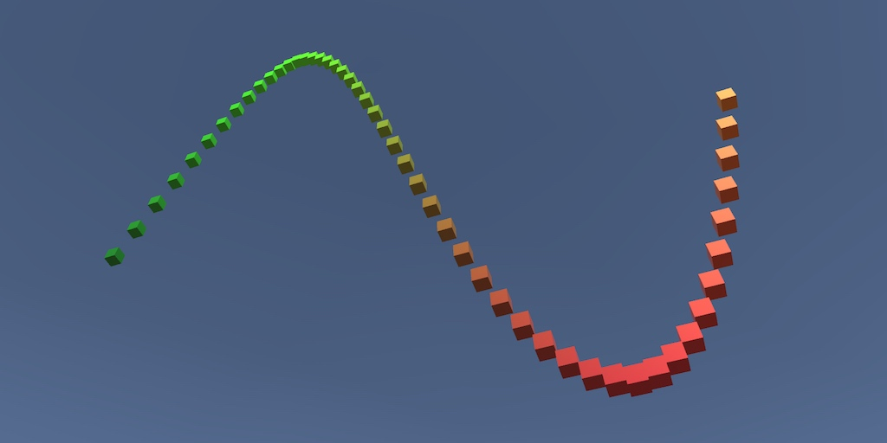

# Building a Graph

### Visualizing Math

* Create a prefab.
* Instantiate a line of cubes.
* Show a mathematical function.
* Create a custom shader.
* Make the graph move.

https://catlikecoding.com/unity/tutorials/basics/building-a-graph/

